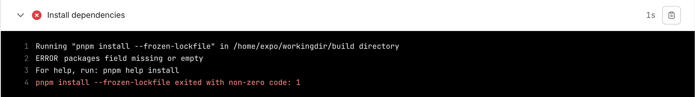
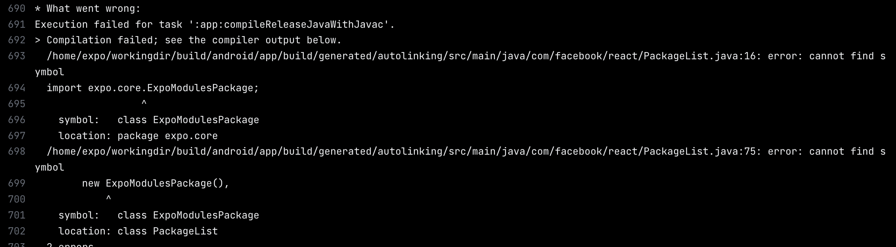
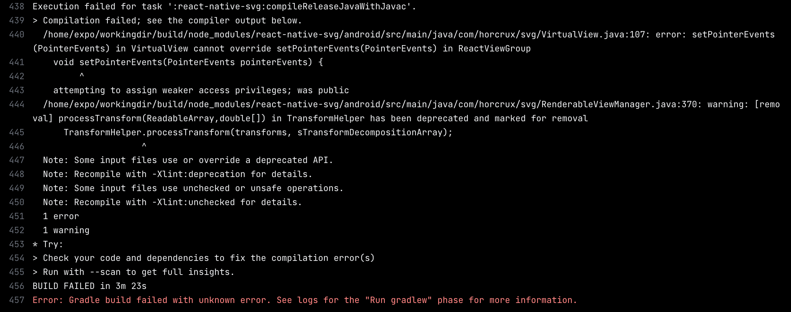

# 构建

## 下载 EAS CLI

```bash
npm install -g eas-cli
```

## 登录 EXPO 账号

```bash
eas login
```

## 在项目根目录运行

```bash
eas build:configure
```

## 在`eas.json`添加

```json
"production": {
  "autoIncrement": true,
  "android": {
    "buildType": "apk"
  }
}
```

## 运行

```bash
eas build --platform android
```

## 使用`pnpm`可能会遇到的报错

### 1. 报错 pnpm install --frozen-lockfile



在`pnpm-workspace.yaml`中添加

```yaml
packages:
  - '.'
```

### 2. 报错 cannot find symbol


在`.npmrc`中添加

```
node-linker=hoisted
```

# BUG

## 使用`react-native-svg`

使用`Expo Go`预览正常，但在构建时的`Run gradlew`阶段报错


> 欢迎各位大佬提供解决方案，本人小白一个。我使用了 gluestack-ui，但我发现里面的`Button`组件里面的`icon`使用了`react-native-svg`，我目前采用的解决方案就是使用`@expo/vector-icons`替换原来的`@gluestack-ui/icon`，可能是里面的哪一个地方用了`setPointerEvents`。我在全网上也找不到这个报错的解决方案，故只能避免使用这个了。
